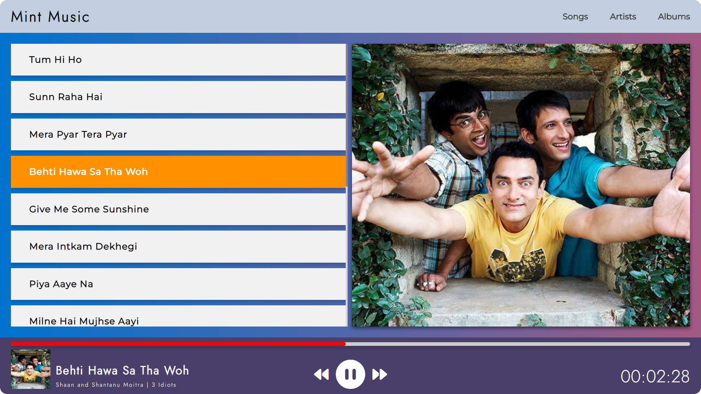

# Mint Music

Welcome to the Mint Music Player built with HTML, CSS, and JavaScript!

This music player is similar to the popular Groove music player and allows you to play music from a selection of 15 songs. The user interface is beautiful and easy to use, making it a pleasure to listen to your favorite tunes.

To get started, simply select a song from the list and click the play button. You can also use the pause and progress bar to seek to a specific point in the song.

I hope you enjoy using my music player and discovering new music! If you have any questions or feedback, please don't hesitate to contact me.

## Features

- Toggle between 15 songs
- Beautiful user interface
- Responsive design
- Minimalistic design

## Usage

To use the music player, simply click the play button to start playing the current song. You can use the skip buttons to move to the previous or next song, or use the track list to select a specific song. The current song and progress are displayed in the progress bar, and the volume can be adjusted using the volume slider.

## Contributing

If you have any feedback or suggestions for the music player, please don't hesitate to open an issue or submit a pull request.

## License

The music player is released under the [MIT License](LICENSE).

## Credits

Built by [Bhupendra Singh](https://github.com/IIT-Bhupendra).
